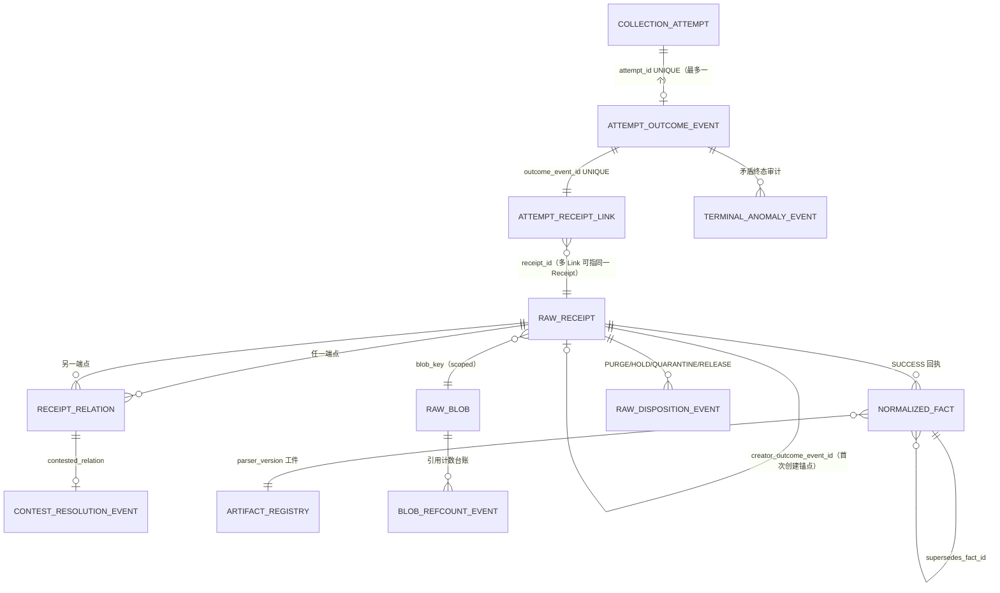

# P1-DATA-D0 · 可实施 ERD 与约束表（ERD_CONSTRAINTS）· rev6

状态：DESIGN-ONLY · 基线 star-web@6f40295 · 2026-09-03
本文件把 rev6 各合同落为**可实施**的表/约束清单（D1-A 建表依据）。
列级语义见 FACT_LAYERING / IDEMPOTENCY / TEMPORAL / DATA_HEALTH（rev6）。

## 1. ERD

## 2. 表与约束（FK / UNIQUE / CHECK 冻结）

### collection_attempt（Start；append-only）
- PK `id`；无 UNIQUE（永不去重）
- **`lease_expires_at` NOT NULL**（UNRESOLVED 确定性谓词时点）
- FK `retry_of_attempt_id → collection_attempt.id`（自引用，可空）
- `attempt_origin ∈ {INITIAL,RETRY,CRASH_REPLAY,SCHEDULER_REISSUE}` CHECK
- `request_params_sanitized` CHECK：键名黑名单校验（api_key/authorization/signature/url-credential）由 repository 强制

### attempt_outcome_event（append-only）
- PK `id`；**UNIQUE(`attempt_id`)**（R5-02 恰一终态）
- FK `attempt_started_id → collection_attempt.id`
- `outcome ∈ {SUCCESS,PARTIAL,SOURCE_ERROR,TRANSPORT_ERROR,TIMEOUT,ABORTED}` CHECK
- `response_bytes_received` boolean；`completed_at` NOT NULL
- **`error_body_hash`（收到错误体必填）· `error_body_ref`（blob_key，仅 retention_class=RAW_RETAINED）· `retention_class`**（许可约束留存）

### attempt_receipt_link（append-only；阻断 1 新增）
- PK `id`；**UNIQUE(`outcome_event_id`)**（每 Outcome 恰一条 Link）
- FK `outcome_event_id → attempt_outcome_event.id`；FK `receipt_id → raw_receipt.id`
- 语义：多 Attempt → 单 Receipt 的完整尝试血缘

### raw_receipt（append-only，不可 UPDATE/DELETE）
- PK `id`；**UNIQUE(`receipt_key`)**
- **`creator_outcome_event_id` UNIQUE NOT NULL** → FK `attempt_outcome_event.id`（首次创建锚点；完整血缘走 Link 表）
- **CHECK (`anchor_slot IS NOT NULL OR anchor_time IS NOT NULL`)**（R5-06）
- CHECK（双锚同在时一致性由采集器断言，违例入隔离表，不落本表）
- `status ∈ {SUCCESS,PARTIAL}`；`payload_hash` NOT NULL；`payload_ref` NOT NULL（无 inline）

### raw_blob（scoped 内容寻址仓；阻断 3 修正）
- **`blob_key = SHA256(scope ‖ payload_hash)`，PK(`blob_key`)**；`scope = (source_id, retention_class)`
- 同字节跨 scope ⇒ 不同 blob_key ⇒ 不同物理对象（「不共享」由键构造保证）
- `length`、`mime`、`created_at`；物理删除仅经处置协议 + 引用计数归零

### receipt_relation（append-only，双端点）
- PK `id`；FK `receipt_id → raw_receipt.id`；FK `related_receipt_id → raw_receipt.id`
- `relation ∈ {SUPERSEDES, CONTESTS, DUPLICATES}` CHECK；`basis`、`creator_ref`、`created_at`

### contest_resolution_event（append-only）
- PK `id`；FK `contested_relation → receipt_relation.id`
- `basis ∈ {FINALIZED_SLOT, SOURCE_PRIORITY, MANUAL_AUDIT}`
- `basis_version` = 策略工件内容哈希 NOT NULL；`resolved_receipt_id` FK；`authorization_ref` NOT NULL

### terminal_anomaly_event（append-only，R5-02 矛盾终态）
- PK `id`；FK `attempt_id → collection_attempt.id`；`kind`、`observed_conflict`、`created_at`

### normalized_fact（append-only；含 narrative/lifecycle 专类）
- PK `id`；FK `receipt_id → raw_receipt.id`（status=SUCCESS 强制，触发器）
- **UNIQUE(`receipt_id, fact_kind, subject_type, subject_id, parser_version, fact_local_key`)**（R5-10；`fact_local_key` NOT NULL，单值='singleton'）
- `effective_time_kind ∈ {CHAIN_EVENT,OBSERVATION_BOUND,UNKNOWN}` CHECK
- FK `supersedes_fact_id → normalized_fact.id`（自引用可空）
- **FK `parser_artifact_id → artifact_registry.id` NOT NULL**（真实外键到 parser 工件）

### fact_relation（append-only；阻断 4 新增）
- PK `id`；FK `fact_a → normalized_fact.id`；FK `fact_b → normalized_fact.id`
- `relation ∈ {CONTRADICTS, SUPERSEDES, TRIGGERS}` CHECK
- **TRIGGERS** = LifecycleTransition 的触发依据关系（fact_a=transition，fact_b=触发事实）
- CONTESTED 资格判定经此表 + contest_resolution_event

### interpretation_context（阻断 4 新增）
- PK `id`；`contract_schema_hash`、`rule_artifact_id` FK→artifact_registry、
  `source_priority_policy_artifact_id` FK→artifact_registry、
  `eligibility_policy_artifact_id` FK→artifact_registry、
  `parser_map jsonb`（四元组键 → {version, artifact_id FK}）、`fact_ids jsonb`、`created_at`
- HISTORICAL 重放引用本实体；缺任一 artifact ⇒ REPLAY_ARTIFACT_MISSING
- narrative-snapshot：`subject_type='narrative'`；lifecycle-transition：`subject_type='project'`，
  `from_stage/to_stage` 受状态图工件版本约束（非法边拒入）

### artifact_registry（append-only）
- PK `id`；UNIQUE(`kind, version`)；`content_hash` NOT NULL；`content_ref` NOT NULL；`created_at`

### raw_disposition_event（append-only）
- 枚举 `PURGE_REQUESTED / PURGE_EXECUTED / PURGE_CANCELLED / QUARANTINE / HOLD / RELEASE`
- FK `receipt_id → raw_receipt.id`；`RELEASE.target_event_id → raw_disposition_event.id`
- 请求五字段：`actor / reason / authorization_ref / scope ∈ {RAW_ONLY, LICENSE_ERASURE} / idempotency_key`
- 全序 `(created_at, event_id)`；执行与 blob 删除同一受控事务/锁边界

### blob_refcount_event（append-only）
- `delta ∈ {+1 receipt, −1 purge, RECONCILE}`；FK `blob_hash → raw_blob.hash`

### evidence_eligibility_policy（ArtifactRegistry 中的工件类型）
- 版本化；InterpretationContext 引用其 `content_hash + content_ref`

## 3. 触发器（D1-A 实现清单）

1. raw_receipt / attempt 两层 / normalized_fact / 各事件表：UPDATE/DELETE ⇒ RAISE；
2. normalized_fact.receipt 的 status=SUCCESS 强制；
3. 无 raw_disposition_event 引用的状态位变更 ⇒ RAISE（静默迁移不存在）；
4. PURGE_EXECUTED 写入前校验：区间无 HOLD、租约持有、refcount 归零或隔离键。

## 4. 断言脚本

仓内路径：`docs/p1-data/D0/verify_d0_contract.py`
执行：`python3 docs/p1-data/D0/verify_d0_contract.py`（repo 根，零依赖）
输出：逐条 PASS/FAIL 与总数；退出码 0/1。原始输出随载体归档。
